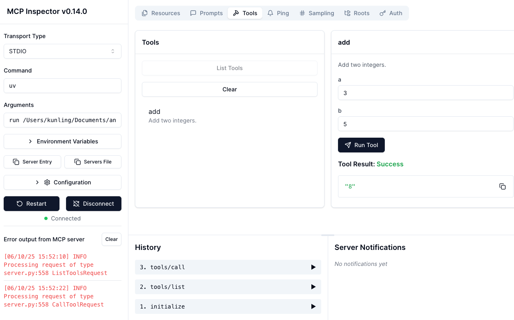
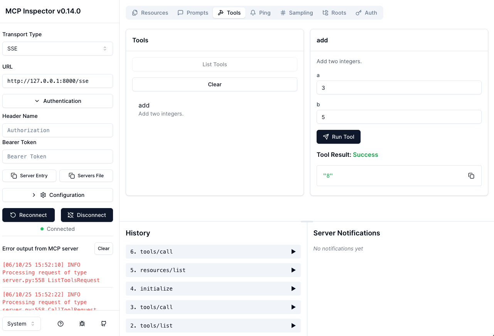
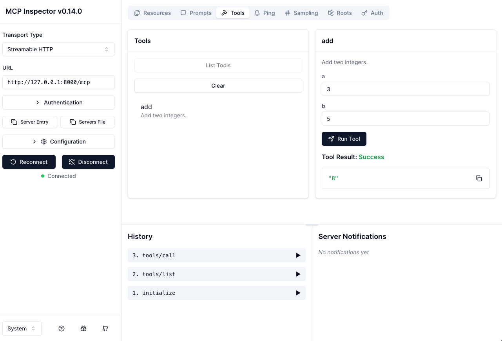
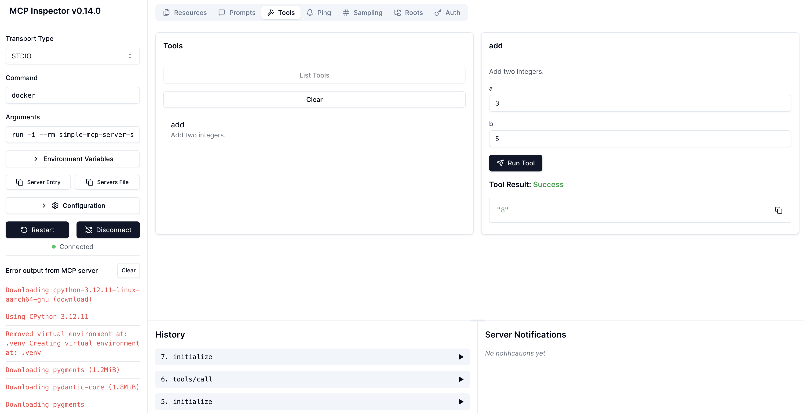
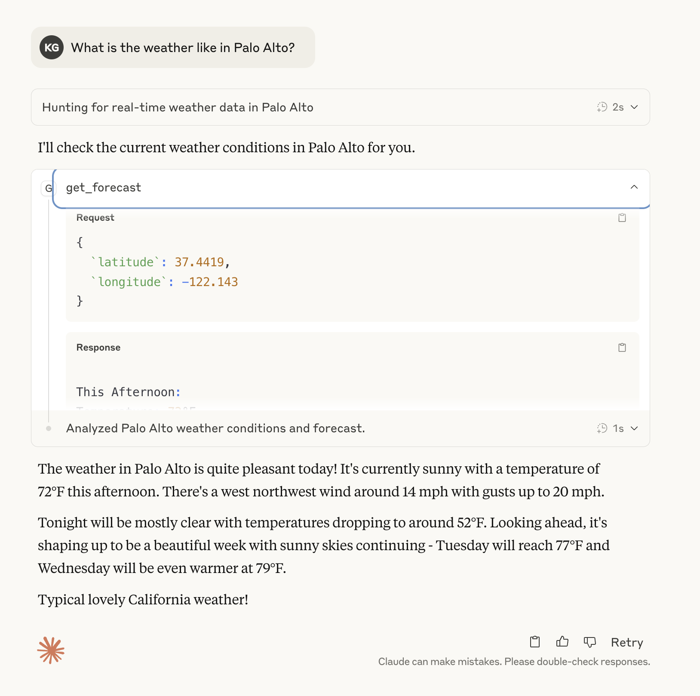

# MCP Quickstart Tutorial

This tutorial demonstrates how to use the Model Context Protocol (MCP) with different transport modes: stdio, SSE, and Streamable HTTP. The example MCP server implements a simple calculator with an `add` tool that adds two integers. The tutorial covers both running the server using Python scripts and deploying it using Docker containers.

## Prerequisites

- Python 3.12
- Node.js and npm (for MCP Inspector 0.14.0)
- uv package manager
- MCP Python library: mcp[cli]==1.9.4
- httpx>=0.28.1
- Docker (for containerized deployment)

## 1. Set up Environment

### Initialize uv and Create Virtual Environment
```bash
# Initialize uv
uv init

# Create virtual environment and activate it
uv venv
source .venv/bin/activate

# Install dependencies
uv add "mcp[cli]==1.9.4" "httpx>=0.28.1"
```

## 2. Set up MCP Inspector

Install Node.js and npm on your local machine, then execute the command to launch the MCP inspector:
```bash
npx -y @modelcontextprotocol/inspector@0.14.0
```
> Note: Ensure MCP inspector version is >= 0.12.0 to support streamable HTTP mode

## 3. Understanding Transport Modes

MCP supports three different transport modes, each with its own characteristics and use cases:

### 3.1 STDIO (Local Only)
- **Definition**: Uses standard input/output streams (stdin, stdout, stderr)
- **Key Features**:
  - One-to-one coupling: Each client directly owns its server subprocess
  - Auto-cleanup: Server process terminates automatically when client exits
  - Optimal for local use: Ideal for desktop applications like Claude Desktop App, Cursor, etc.

### 3.2 SSE (Legacy, Deprecated)
- **Definition**: Uses Server-Sent Events with two endpoints:
  - POST /messages (commands)
  - GET /sse (streamed replies)
- **Limitations**:
  - Stateful design by default
  - Hard to scale beyond 2 replicas without sticky session management
  - Being phased out in favor of Streamable HTTP

### 3.3 Streamable HTTP (Recommended)
- **Definition**: Uses a single endpoint `/mcp` supporting both GET and POST methods
- **Advantages**:
  - Built-in session handling
  - Resumable connections
  - Simpler architecture
  - Optional SSE streaming support
  - Enables stateless server designs
  - Better scalability and reliability

## 4. Running MCP Server and Client with Python Script

### 4.1 Stdio Mode

#### Server
The stdio server should not be run directly as it requires a client connection due to its one-to-one coupling nature.

#### Client
```bash
# List all the tools
uv run python client.py ./server_stdio.py
# The client will automatically start the server as a subprocess
uv run python client.py ./server_stdio.py add a=5 b=3
```
#### MCP Inspector
Configuration the connection: 
* Transport Type: STDIO
* Command: uv
* Arguments: run python server_stdio.py


> Testing the `add` tool in stdio mode. The client automatically starts the server as a subprocess.

### 4.2 SSE Mode

#### Server
```bash
# Start the SSE server
uv run python server_sse.py
```

#### Client
```bash
# List all the tools
uv run python client.py http://127.0.0.1:8000/sse 
# Connect to the SSE server and call the add tool
uv run python client.py http://127.0.0.1:8000/sse add a=10 b=20
```
#### MCP Inspector
Configuration the connection: 
* Transport Type: SSE
* URL: http://127.0.1:8000/sse


> Testing the `add` tool in SSE mode. The server runs independently and communicates via Server-Sent Events.

### 4.3 Streamable HTTP Mode

#### Server
```bash
# Start the Streamable HTTP server
uv run python server_streamable_http.py
```

#### Client
```bash
# List all the tools
uv run python client.py http://127.0.0.1:8000/mcp 
# Connect to the Streamable HTTP server and call the add tool
uv run python client.py http://127.0.0.1:8000/mcp add a=100 b=200
```
#### MCP Inspector
Configuration the connection: 
* Transport Type: Streamable HTTP
* URL: http://127.0.1:8000/mcp


> Testing the `add` tool in Streamable HTTP mode. The server uses a single endpoint for both commands and responses.

## 5. Running MCP Server and Client with Docker Image

### 5.1 Stdio Mode

#### Build Docker Image
```bash
# Build the Docker image for stdio mode
docker build -t simple-mcp-server-stdio -f Dockerfile.stdio .
```

#### Client
You cannot test the client directly since the server is in the Docker container and is not set up by the client in this script. However, you can implement your own code to set up Docker as a process and connect the client with it.

#### MCP Inspector
Configuration the connection: 
* Transport Type: STDIO
* Command: docker
* Arguments: run -i --rm simple-mcp-server-stdio


> Testing the `add` tool in stdio mode using Docker. Note that stdio mode is primarily designed for local use.

### 5.2 SSE Mode

#### Build Docker Image
```bash
# Build the Docker image for SSE mode
docker build -t simple-mcp-server-sse -f Dockerfile.sse .
```

#### Run Docker Container
```bash
# Run the SSE server container
docker run -p 8000:8000 simple-mcp-server-sse
```

#### Client
```bash
# List all the tools
uv run python client.py http://127.0.0.1:8000/sse 
# Connect to the SSE server and call the add tool
uv run python client.py http://127.0.0.1:8000/sse add a=10 b=20
```
#### MCP Inspector
Configuration the connection: 
* Transport Type: SSE
* URL: http://127.0.1:8000/sse

> Testing the `add` tool in SSE mode using Docker. The server runs in an isolated environment with all dependencies included.

### 5.3 Streamable HTTP Mode

#### Build Docker Image
```bash
# Build the Docker image for Streamable HTTP mode
docker build -t simple-mcp-server-http -f Dockerfile.http .
```

#### Run Docker Container
```bash
# Run the Streamable HTTP server container
docker run -p 8000:8000 simple-mcp-server-http
```

#### Client
```bash
# List all the tools
uv run python client.py http://127.0.0.1:8000/mcp 
# Connect to the Streamable HTTP server and call the add tool
uv run python client.py http://127.0.0.1:8000/mcp add a=100 b=200
```
#### MCP Inspector
Configuration the connection: 
* Transport Type: Streamable HTTP
* URL: http://127.0.1:8000/mcp


> Testing the `add` tool in Streamable HTTP mode using Docker. The server runs in an isolated environment with all dependencies included.


## 6. Using MCP with Claude Desktop App

### 6.1 Running with UV Package Manager
The repository includes a weather service example in `weather_mcp.py`. 

- Follow the official guide at [Testing Your Server with Claude Desktop](https://modelcontextprotocol.io/quickstart/server#testing-your-server-with-claude-for-desktop)

- Use the provided `weather_mcp.py` script as your MCP server

### 6.2 Running with Docker
- Build the Docker image:
```bash
docker build -t weather-mcp-server-stdio -f Dockerfile.weather.stdio .
```

- Configure Claude Desktop App:
   - Open Claude Desktop App settings
   - Add the following MCP configuration:
```json
{
  "mcpServers": {
    "weather": {
      "command": "docker",
      "args": [
        "run",
        "-i",
        "--rm",
        "weather-mcp-server-stdio"
      ]
    }
  }
}
```

- Verify the setup:
   - The weather tool should appear in Claude Desktop App
   - You can test it by asking Claude about the weather as shown below: 



## 7. Additional Resources

- [Introduction - MCP](https://modelcontextprotocol.io/introduction)
- [MCP Docs](https://docs.anthropic.com/en/docs/mcp)
- [MCP Python-SDK](https://github.com/modelcontextprotocol/python-sdk)
- [Docker MCP images](https://hub.docker.com/catalogs/mcp)
- [MCP Inspector](https://github.com/modelcontextprotocol/inspector)
- [List of MCP Servers](https://github.com/docker/mcp-servers)
- [Awesome MCP Servers](https://mcpservers.org/)
- [Integrate MCP for Claude Desktop](https://modelcontextprotocol.io/quickstart/user)
